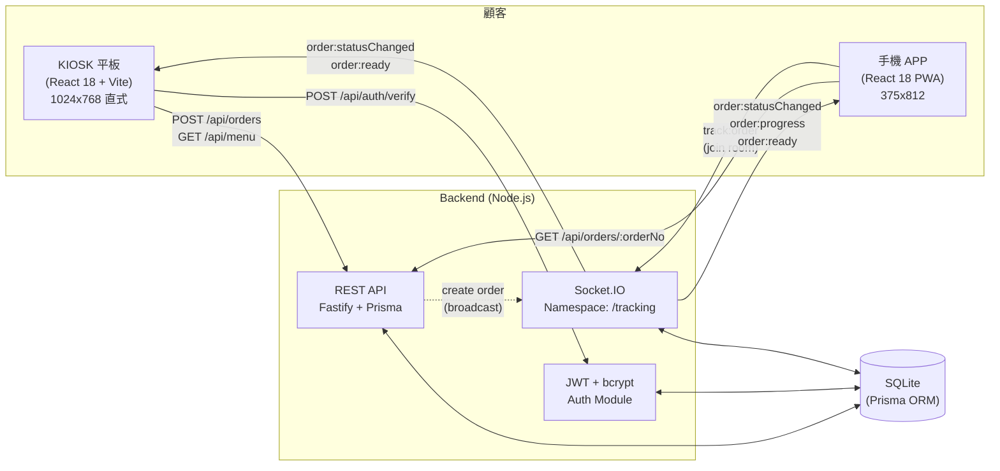

# 系統架構 — 餐飲點餐快手

## 1. 系統總覽

## 2. 模組劃分與責任

| 模組 | 路徑 | 責任 |
|------|------|------|
| **shared-contracts** | `shared-contracts/` | 跨端型別、API 契約、WS 事件、Prisma schema |
| **backend** | `backend/` | REST + WS 服務、業務邏輯、認證、訂單/會員 CRUD |
| **kiosk-frontend** | `kiosk-frontend/` | 平板自助點餐 UI、購物車、結帳 |
| **mobile-app** | `mobile-app/` | 手機進度追蹤、會員中心、優惠券 |
| **scripts** | `scripts/` | 啟動 / 維運腳本(如 start-all.sh) |
| **docs** | `docs/` | 設計文件、決策紀錄 |

## 3. 資料流

### 3.1 KIOSK 點餐 → 建立訂單

1. 顧客在 KIOSK �覽菜單(`GET /api/menu`)。
2. 加入購物車 → 結帳畫面選擇優惠券、會員登入(`POST /api/auth/verify`)。
3. 提交訂單(`POST /api/orders { cart, memberId?, couponCode? }`)。
4. 後端:
   - 計算 subtotal / discount / totalAmount
   - 產生 `orderNo` 與 `pickupNumber`
   - 預估 `estimatedReadyAt`(基於 PROGRESS_STAGE_MAP 加總)
   - 寫入 `Order`、`OrderItem`、`OrderStatusLog`
   - 廣播 WS `order:statusChanged` 至 `order:${orderNo}` 房間
5. KIOSK 顯示「訂單已成立」+ 取餐號碼 QR Code。

### 3.2 手機 APP 追蹤進度

1. 顧客用手機掃 KIOSK 上的 QR Code → 進入 mobile-app 追蹤頁。
2. 前端建立 Socket.IO 連線至 `/tracking`,送出 `track:order { orderNo }`,加入 `order:${orderNo}` 房間。
3. 後端在訂單狀態變更時廣播:
   - `order:statusChanged` — 訂單狀態完整更新
   - `order:progress` — 階段 / 百分比 / 預估完成時間
   - `order:ready` — READY 時觸發,可觸發手機震動 / 推播
4. 手機 APP 將進度視覺化(進度條 + 階段圖示)。

### 3.3 門市出餐人員推進階段

1. 門市人員透過 admin 介面點擊「下一階段」
2. 呼叫 `POST /api/admin/orders/:orderNo/advance`
3. 後端:`getNextStage(current)` → 更新 status → 寫 OrderStatusLog → 廣播 WS

## 4. REST API 端點表

| Method | Path | 用途 | Request | Response |
|--------|------|------|---------|----------|
| POST | `/api/auth/login` | 發送驗證碼 | `LoginRequestBody` | `LoginResponseBody` |
| POST | `/api/auth/verify` | 驗證碼兌換 token | `VerifyRequestBody` | `VerifyResponseBody` |
| GET  | `/api/menu` | 取得完整菜單 | — | `MenuResponseBody` |
| POST | `/api/orders` | 建立訂單 | `CreateOrderRequestBody` | `CreateOrderResponseBody` |
| GET  | `/api/orders/:orderNo` | 訂單詳情 | — | `GetOrderResponseBody` |
| GET  | `/api/orders/member/:memberId` | 會員歷史訂單 | query `limit` | `GetMemberOrdersResponseBody` |
| PATCH | `/api/orders/:orderNo/status` | 更新訂單狀態 | `UpdateOrderStatusRequestBody` | `UpdateOrderStatusResponseBody` |
| POST | `/api/admin/orders/:orderNo/advance` | 推進下一階段 | — | `AdvanceOrderResponseBody` |
| GET  | `/api/members/:id` | 取得會員 | — | `GetMemberResponseBody` |
| GET  | `/api/members/:id/coupons` | 會員優惠券列表 | — | `GetMemberCouponsResponseBody` |
| POST | `/api/members/:id/points/add` | 加減點數 | `AddPointsRequestBody` | `AddPointsResponseBody` |
| GET  | `/healthz` | 健康檢查 | — | `HealthResponseBody` |

> Demo 階段固定驗證碼:`1234`。

## 5. WebSocket 事件表

**Namespace:** `/tracking`  
**房間:** `order:${orderNo}`(每張訂單獨立房間)

| 事件名 | 方向 | Payload | �發時機 |
|--------|------|---------|----------|
| `track:order` | C → S | `TrackOrderRequest` | 加入訂單房間 |
| `order:statusChanged` | S → C | `OrderStatusChangedEvent` | 訂單狀態變更 |
| `order:progress` | S → C | `OrderProgressEvent` | 階段切換,廣播百分比 |
| `order:ready` | S → C | `OrderReadyEvent` | 進入 READY,觸發手機震動 |

## 6. 跨端共享契約 — shared-contracts

`shared-contracts` 為純 TypeScript package,提供:

- **`src/types/`** — 業務型別(menu / order / member / auth)。
- **`src/api/endpoints.ts`** — REST path 常數 + 每端點 Request/Response 型別。
- **`src/realtime/events.ts`** — Socket.IO Event Map 與 payload 型別。
- **`src/realtime/stages.ts`** — 製作階段 + 進度百分比常數。
- **`prisma/schema.prisma`** — 完整資料模型(backend 啟動時複製使用)。

消費方式:
- **backend** 在 Fastify 路由與 Socket.IO handler 中 `import` 型別,確保傳輸形狀一致。
- **kiosk-frontend** / **mobile-app** 在 fetch / axios / socket.io-client 呼叫處 `import` 對應型別。
- **package.json workspaces** 機制下,`@smart-dining/contracts` 直接 link,無需發佈。

## 7. 非功能性需求

### 7.1 效能

- **端到端目標:** 點餐 → 取餐 < 3 分鐘。
- **WS 廣播延遲:** < 200ms(本地網路)。
- **API p95:** < 300ms。
- **預估時間計算:** 後端以 `PROGRESS_STAGE_MAP.estimatedSeconds` 加總,於訂單建立時一次寫入 `Order.estimatedReadyAt`。

### 7.2 安全性

- **認證:** JWT(HS256),`Authorization: Bearer <token>`。
- **密碼/驗證碼:** Demo 階段不存密碼,僅固定驗證碼 `1234`;正式版接 OTP provider。
- **個資:** 會員資料以最少必要為原則儲存(僅 phone + name + points)。
- **SQL Injection:** 全程透過 Prisma ORM,不拼接原生 SQL。
- **CORS:** KIOSK 與 mobile 限定來源,backend 啟動時設定 allowlist。

### 7.3 可擴展性

- **Monorepo workspaces:** 新增子系統只需新增 workspace 並依賴 `@smart-dining/contracts`。
- **WebSocket 房間:** 以 orderNo 為單位,支援多門市擴展(後續可在房名前綴 `storeId`)。
- **階段驅動:** 新增階段僅需修改 `PROGRESS_STAGES` 與 `PROGRESS_STAGE_MAP`,不影響既有資料。
- **Prisma migrate:** schema 變更走標準 migration 流程。

---

## 部署拓樸

### Dev(本期)

- 本機單機
- Backend:Node.js process(port 4000)
- KIOSK:Vite dev server(port 5173)
- Mobile:Vite dev server(port 5174)
- DB:SQLite 檔案(`backend/data/dev.db`)
- 啟動:`./scripts/start-all.sh`

### Staging(規劃中)

- 單機 docker-compose
- 三個服務各一個 container
- DB:PostgreSQL 取代 SQLite(Prisma schema 不變)
- 對外網域 + HTTPS(Nginx reverse proxy)

### Prod(待評估)

- 雲端:Kubernetes / ECS / Cloud Run
- DB:PostgreSQL + Read replica
- CDN:CloudFront / Cloudflare(靜態資源)
- WebSocket:Redis adapter 支援多實例水平擴展
- 監控:Prometheus + Grafana + Sentry

---

## 後續 Roadmap

### v1.1 — 多門市

- Store 模型 + 多店代碼
- 訂單歸屬到特定門市
- 跨門市會員資料同步
- 中央 dashboard 看全部門市營運

### v1.2 — 第三方外送平台接單

- Uber Eats / Foodpanda webhook 整合
- 外送訂單與內用訂單統一管理
- 出餐流程分支(內用 → 自取;外送 → 打包交給外送員)

### v1.3 — 線上預訂送餐

- 顧客在家下單,選擇送達時間
- GPS 定位 + 配送範圍
- 與外送平台整合配送

### v2.0 — AI 加購推薦

- 根據消費歷史 ML 模型
- 「上次你點了 XX,今天要不要試試 YY?」
- 個人化優惠券

### v2.x — 其他

- 廚房出餐螢幕(KDS,Kitchen Display System)
- 庫存管理(品項售完自動 disable)
- 多語言(英、日、韓)
- 排隊叫號廣播整合

