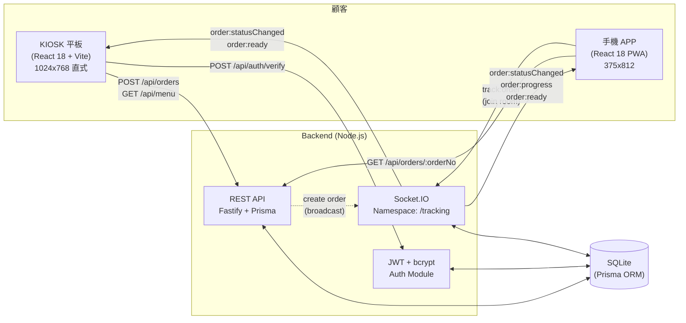

# 餐飲點餐快手 — Smart Dining Self-Ordering & Tracking System

> **點餐、取餐、會員回訪一次完成**

整合「大螢幕自助點餐 KIOSK」與「手機 APP 即時取餐追蹤 + 會員回訪」,為餐飲門市提供從點餐到取餐、再到下次回購的完整閉環。

---

## 🎯 一句話價值主張

> 用 KIOSK 平板讓顧客 2 分鐘自助點餐、用 WebSocket 即時推送取餐進度到顧客手機、用點數 + 優惠券雙引擎提升會員回購率。

---

## 📐 系統架構



詳細分層、模組責任、資料流請見 [ARCHITECTURE.md](./ARCHITECTURE.md)。

---

## 🛠️ 技術棧

| 層 | 技術 |
|----|------|
| **後端** | Node.js 18+ / TypeScript / Fastify / Prisma ORM / SQLite / Socket.IO / JWT |
| **KIOSK 前端** | React 18 / Vite / TypeScript / Tailwind CSS(平板 1024×768 直式) |
| **Mobile APP** | React 18 / Vite / TypeScript / Tailwind CSS + PWA(手機 375×812) |
| **跨端共享** | TypeScript contracts package(`@smart-dining/contracts`) |
| **即時通訊** | Socket.IO(`/tracking` namespace,`order:${orderNo}` room) |
| **認證** | JWT(HS256)+ bcrypt;Demo 驗證碼固定 `1234` |
| **開發維運** | npm workspaces / tsx watch / `scripts/start-all.sh` |

---

## 📁 目錄結構

```
smart-dining/
├── shared-contracts/           # 跨端共用 TypeScript 契約
│   ├── prisma/schema.prisma   # 單一資料來源(DB 模型)
│   └── src/
│       ├── api/endpoints.ts   # REST 路徑常數 + Request/Response 型別
│       ├── realtime/          # Socket.IO 事件 + 製作階段常數
│       └── types/             # menu / order / member / auth 型別
│
├── backend/                    # Fastify API + Socket.IO server
│   ├── src/
│   │   ├── modules/           # auth / menu / orders / admin / members
│   │   ├── lib/               # pickupNumber、orderNo、verifyCode 工具
│   │   └── server.ts          # Fastify + Socket.IO bootstrap
│   ├── scripts/               # test-api.sh / ws-test.mjs 等驗證腳本
│   └── data/dev.db            # SQLite(由 db:reset 產生)
│
├── kiosk-frontend/             # KIOSK 平板自助點餐 UI(React 18)
│   └── src/
│       ├── api/               # fetch 封裝(menu / orders / auth)
│       ├── components/        # Header / CartItem / QRCode / NumberPad
│       ├── pages/             # KioskPage / CheckoutPage / CompletePage
│       └── hooks/             # useMenu 等資料 hooks
│
├── mobile-app/                 # 手機 APP(React 18 PWA)
│   └── src/
│       ├── api/               # fetch 封裝(orders / members / auth)
│       ├── realtime/          # socket.ts(連 /tracking、track:order)
│       ├── store/             # authStore / trackStore(zustand)
│       └── pages/             # TrackPage / MemberPage / HistoryPage
│
├── scripts/
│   ├── start-all.sh           # 🚀 一鍵啟動三個服務
│   └── stop-all.sh            # 🛑 停止所有服務
│
├── docs/                       # 文件
│   ├── design-spec.md         # UI 設計規格
│   ├── QA-REPORT.md           # 整合測試報告
│   ├── USER-FLOWS.md          # 使用者旅程
│   ├── API.md                 # REST + WebSocket API 參考
│   └── DEMO-SCRIPT.md         # 提案 Demo 5 分鐘腳本
│
├── ARCHITECTURE.md             # 系統架構與資料流
├── package.json                # npm workspaces 根
└── README.md                   # 你正在看的這個檔
```

---

## 🚀 快速啟動(5 分鐘內跑起來)

### 前置需求

- **Node.js 18+**(本專案在 Node v22.23.2 驗證通過)
- **npm**(或 pnpm;預設使用 npm workspaces)
- macOS / Linux / WSL2(Windows 需啟用 WSL)

### 一鍵啟動(三個服務一起跑)

```bash
cd "/Users/sean/Documents/Agent space/smart-dining"
./scripts/start-all.sh
```

腳本會自動:

1. ✅ 檢查 Node 版本(需 ≥ 18)
2. ✅ 首次啟動時執行 `backend/db:reset` 建立 SQLite + 種子資料
3. ✅ 背景啟動 **Backend(port 4000)**、**KIOSK(port 5173)**、**Mobile(port 5174)**
4. ✅ 跑健康檢查(`/healthz`、5173、5174)
5. ✅ 印出存取 URL 與 Demo 帳號

啟動成功後:

```
🎉 所有服務已啟動!
   ┌─ KIOSK 平板:  http://localhost:5173
   ├─ Mobile APP:  http://localhost:5174
   └─ Backend API: http://localhost:4000

📋 Demo 帳號:
   VIP  會員: 0912345678 / 驗證碼 1234
   一般會員: 0987654321 / 驗證碼 1234

📊 日誌位置: ./.logs/
🛑 停止服務: ./scripts/stop-all.sh
```

### 手動啟動(分三個 terminal,適合除錯)

```bash
# Terminal 1 — Backend
cd "/Users/sean/Documents/Agent space/smart-dining/backend"
npm run db:reset      # 首次需要:建立 DB + 種子(2 個會員 + 10 個菜單)
npm run dev            # tsx watch src/server.ts → http://localhost:4000

# Terminal 2 — KIOSK
cd "/Users/sean/Documents/Agent space/smart-dining/kiosk-frontend"
npm run dev            # Vite → http://localhost:5173

# Terminal 3 — Mobile
cd "/Users/sean/Documents/Agent space/smart-dining/mobile-app"
npm run dev            # Vite → http://localhost:5174
```

### 停止所有服務

```bash
cd "/Users/sean/Documents/Agent space/smart-dining"
./scripts/stop-all.sh
```

停止腳本會讀取 `.pids/` 目錄裡的 PID 檔並送出 SIGTERM,然後 `pkill` 清掉殘留 `tsx` / `vite` 進程。

### 常見 npm 腳本(根目錄)

| 指令 | 作用 |
|------|------|
| `npm install` | 安裝所有 workspace 依賴 |
| `npm run dev` | 同時啟動三個子系統(透過各自 `dev` 腳本) |
| `npm run build` | 建置所有子專案 |
| `npm run test` | 跑所有子專案測試 |
| `npm run db:reset`(在 `backend/`) | 重灌 SQLite + 種子資料 |
| `npm run db:seed`(在 `backend/`) | 只重跑種子(保留既有資料) |

---

## 🧪 Demo 帳號

種子資料中已預建 2 個會員、2 張優惠券、10 個菜單品項、4 個分類。

| 角色 | 電話 | 驗證碼 | 點數 | 優惠券 |
|------|------|--------|------|--------|
| **VIP 會員 王小明** | `0912345678` | `1234` | 500 點 | `VIP10`(9 折,百分比) |
| **一般會員 林小華** | `0987654321` | `1234` | 50 點 | `WELCOME`(NT$20 折抵) |

> Demo 階段驗證碼固定為 `1234`;正式版會接 SMS gateway。詳細會員資料可從 `backend/src/seed.ts` 調整。

---

## 🎬 Demo 5 分鐘腳本

完整版見 [docs/DEMO-SCRIPT.md](./docs/DEMO-SCRIPT.md)。快速版流程:

1. **KIOSK 點餐** → 客製化 → 結帳 → 取餐號 `A002`
2. **手機掃 KIOSK 上的 QR** → 進入取餐進度頁
3. **門市後台(/admin)** 推進狀態 → 手機畫面同步更新(進度從 10% 跑到 100%)
4. **READY 時手機震動通知 + 閃橘光**
5. **結帳展示 VIP 9 折、點數累積**(NT$1 = 1 點)

---

## 📊 KPI 對應(原始專案目標)

| KPI | 目標 | 本系統設計對應 |
|-----|------|----------------|
| 自助點餐完成率 | > 90% | 大按鈕(≥ 48px)、直式版面、≤ 5 步驟完成;chips 視覺化客製化 |
| 平均點餐時間 | < 2 分鐘 | 預設推薦品項、底部客製化面板不擋視線、購物車右側固定 |
| 客製化加購率提升 | ≥ 15% | 底部客製化面板主動推薦加購 chips(SINGLE/MULTI 兩種) |
| 會員回購率提升 | ≥ 20% | 點數回饋(NT$1 = 1 點)、專屬優惠券、9 折 VIP 等級制 |
| 取餐進度透明化 | 顯著降低等待體感 | WebSocket 即時推送 + 階段 chip + 倒數計時 |

---

## 📚 進階文件

| 文件 | 內容 |
|------|------|
| [ARCHITECTURE.md](./ARCHITECTURE.md) | 系統架構、模組責任、資料流、效能/安全/擴展性 |
| [docs/design-spec.md](./docs/design-spec.md) | UI 設計規格(品牌色、按鈕尺寸、版面配置) |
| [docs/USER-FLOWS.md](./docs/USER-FLOWS.md) | 三條關鍵 user flow 詳細圖文 |
| [docs/API.md](./docs/API.md) | REST + WebSocket API 完整參考(請求/回應/錯誤碼) |
| [docs/QA-REPORT.md](./docs/QA-REPORT.md) | 整合測試報告(環境、12 個 checkpoints、已知問題) |
| [docs/DEMO-SCRIPT.md](./docs/DEMO-SCRIPT.md) | 提案 Demo 5 分鐘腳本(開場/場景一~四/結尾) |
| [backend/README.md](./backend/README.md) | 後端模組、Prisma migration、scripts 用途 |
| [kiosk-frontend/README.md](./kiosk-frontend/README.md) | KIOSK 前端目錄結構、開發指令 |
| [mobile-app/README.md](./mobile-app/README.md) | Mobile APP 路由、狀態管理、PWA 設定 |

---


## 🚀 部署到正式環境

詳細步驟見 **[DEPLOYMENT.md](DEPLOYMENT.md)**,快速摘要:

```
KIOSK  + Mobile   →  Vercel(免費)
Backend + DB      →  Railway($5/月免費額度)
```

```bash
# 1. 推到 GitHub
gh repo create smart-dining --public --source=. --push

# 2. Backend 切到 Postgres(部署前)
./scripts/prepare-prod.sh

# 3. Vercel 與 Railway 各 import repo,設環境變數即可
```

> 為什麼 backend 不上 Vercel?Socket.IO 需長連線、SQLite 需檔案系統,Vercel serverless 不適合。


## 🛑 常見問題(FAQ)

**Q: 為什麼驗證碼固定 `1234`?**
A: Demo 階段簡化流程,讓評審委員不用真的收 SMS 也能登入。生產環境會接 SMS gateway(Twilio / Every8d / 三竹資訊),邏輯集中在 `backend/src/lib/verifyCode.ts`,替換為 OTP provider 即可。

**Q: SQLite 是否適合正式上線?**
A: 原型 / MVP / Demo 適用。**高併發或多門市**請改 PostgreSQL,**Prisma schema 不變**,只需:
1. 改 `backend/.env` 的 `DATABASE_URL` 為 `postgresql://...`
2. `npx prisma migrate dev` 重新生成 migration
3. 重啟 backend

**Q: 怎麼新增菜單品項?**
A: 修改 `backend/src/seed.ts` 的 `categories` / `menuItems` 陣列,然後:
```bash
cd backend && npm run db:reset   # 重灌 DB + 重跑 seed
```
或直接對 Prisma 寫 `prisma.menuItem.create({...})` 後重啟 backend。

**Q: 怎麼修改主色 / 品牌色?**
A: KIOSK 與 Mobile 都用 Tailwind。修改 `tailwind.config.js` 的 `theme.extend.colors`(`brand-orange` = `#FF6B35` 等),或直接覆寫 utility class。

**Q: WebSocket 為什麼有時候收不到事件?**
A: 兩個常見原因:
1. mobile 端未 `socket.emit('track:order', { orderNo })` 加入訂單房間 → 確認 `mobile-app/src/realtime/socket.ts` 的初始化流程。
2. 跨網域(Nginx 反向代理)未打開 WebSocket upgrade → 確認 proxy 設定 `Upgrade` / `Connection` 標頭。

**Q: 怎麼部署到正式環境?**
A: 見 [ARCHITECTURE.md §部署拓樸](./ARCHITECTURE.md)。Dev / Staging / Prod 三階段,Staging 起建議 docker-compose,Prod 需 Postgres + Redis adapter + CDN。

**Q: `./scripts/start-all.sh` 印「backend 已在運行,跳過」怎麼辦?**
A: 之前的 backend 還活著(PID 紀錄在 `.pids/backend.pid`)。直接跑 `./scripts/stop-all.sh` 再 `./scripts/start-all.sh` 即可;若 port 4000 仍被佔用,`lsof -ti:4000 | xargs -r kill -9` 強殺。

**Q: backend `EADDRINUSE: 0.0.0.0:4000`?**
A: 同上,port 已被佔用。`start-all.sh` 用 PID 檔保護,若舊實例沒寫 PID 檔(例如手動 `npm run dev` 啟動),就會撞 port。

---

## 🤝 貢獻流程(給新進工程師)

1. **clone 後**: `npm install`(根目錄,workspaces 會自動處理所有子系統)
2. **跑起來**: `./scripts/start-all.sh`,確認三個 URL 都通
3. **改 contract**: `shared-contracts/src/**` → 改 `backend/src/modules/**` → 改前端 `api/**`,三端型別同步
4. **改資料庫**: `backend/prisma/schema.prisma` → `npx prisma migrate dev --name <change>`
5. **改 menu**: `backend/src/seed.ts` → `npm run db:reset`
6. **commit 前**: 三個子系統都要 `npm run build` 過,TS 型別錯誤會擋下
7. **CI 整合測試**(若已配置): `backend/scripts/test-api.sh` 與 `backend/scripts/ws-test.mjs` 必過

---

## 📄 授權

MIT License

---

## 🏗️ 專案狀態

- **版本**: `@smart-dining/backend@0.1.0` / `@smart-dining/kiosk@0.1.0` / `@smart-dining/mobile@0.1.0`
- **整合測試**: 詳見 [docs/QA-REPORT.md](./docs/QA-REPORT.md)(P1 admin-advance broadcast 已修補)
- **下一步**: v1.1 多門市、v1.2 第三方外送接單(見 ARCHITECTURE.md Roadmap 章節)

<!-- Last validated: 2026-09-06 by OpenClaw Overnight Dev -->
